<p align="center">
  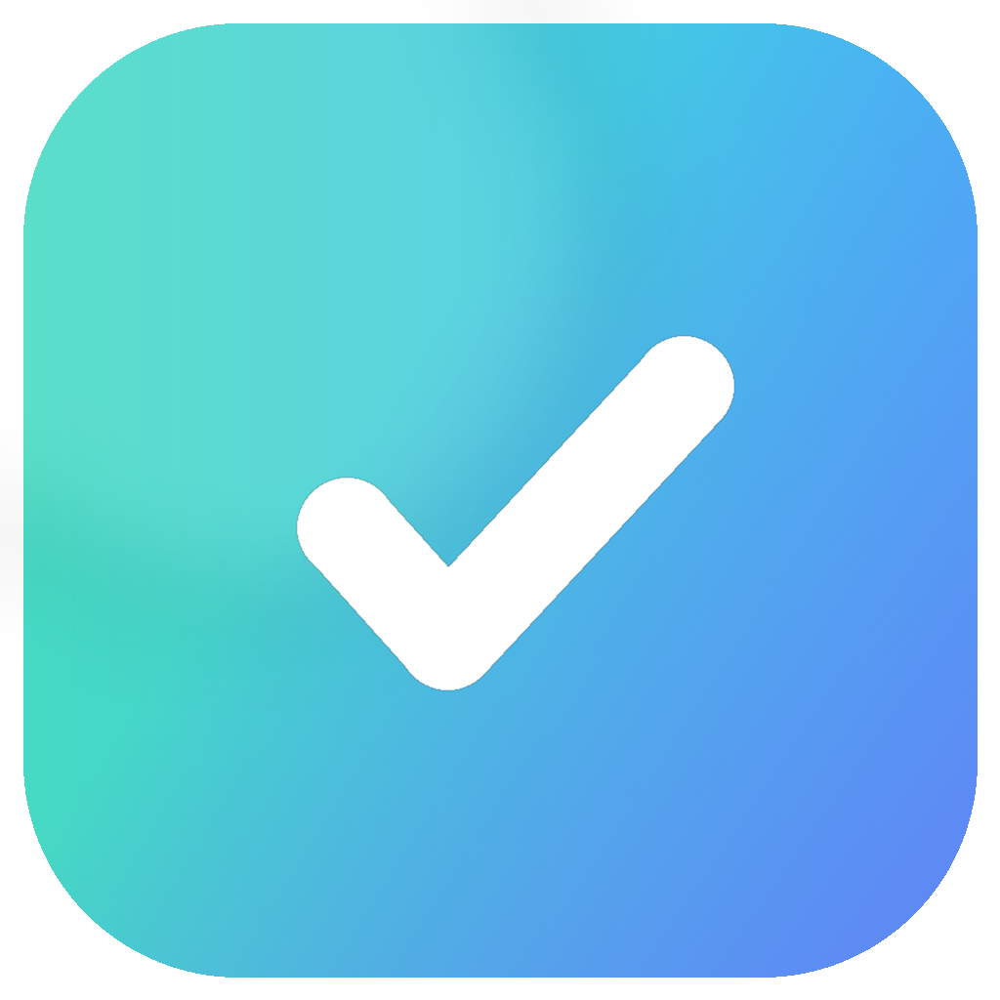
</p>

<h1 align="center">To-Do</h1>

<p align="center">
  <b>To-Do · Note · Daily</b><br>
  A local-first Android app for tasks, notes, and repeat-every-day small routines.
</p>

<p align="center">
  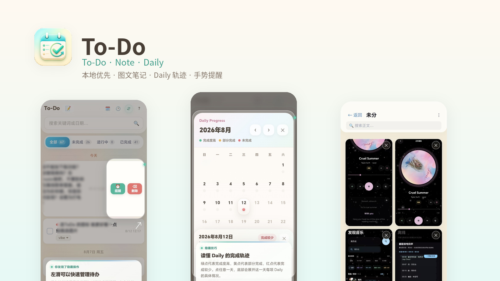
</p>

<p align="center">
  <a href="https://github.com/C666249/To-Do/releases/latest/download/To-Do-v1.19.1.apk"><b>⬇️ Download Android APK · v1.19.1</b></a>
</p>

## Overview

To-Do is a lightweight personal productivity project that keeps **normal tasks, long-term notes, and repeat-every-day items** in one place.

## Screenshots

<p align="center">
  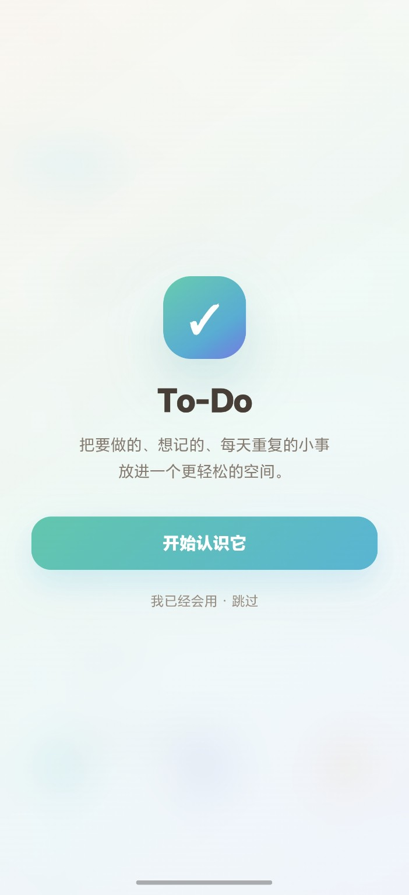
  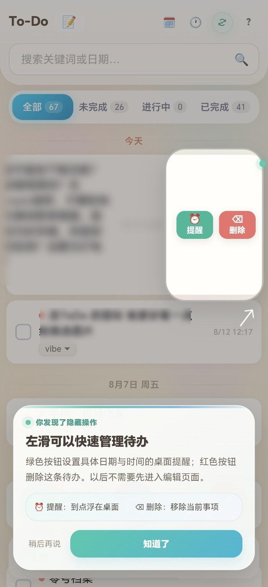
  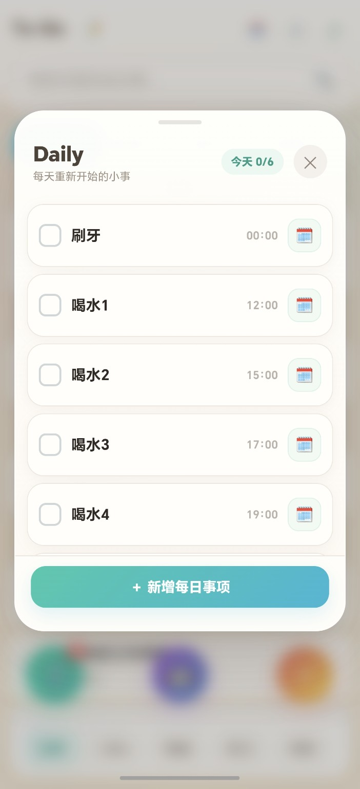
  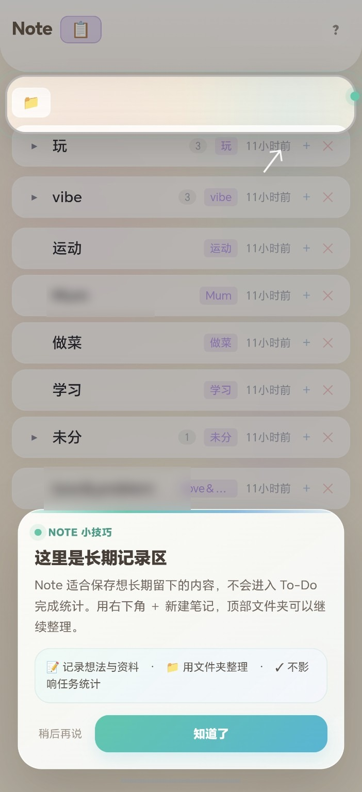
</p>

<p align="center">
  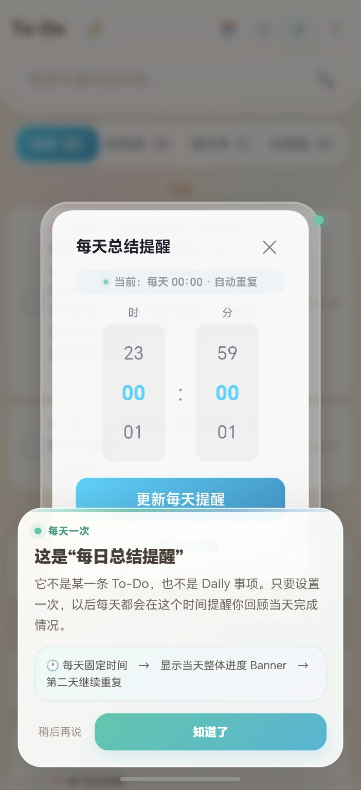
  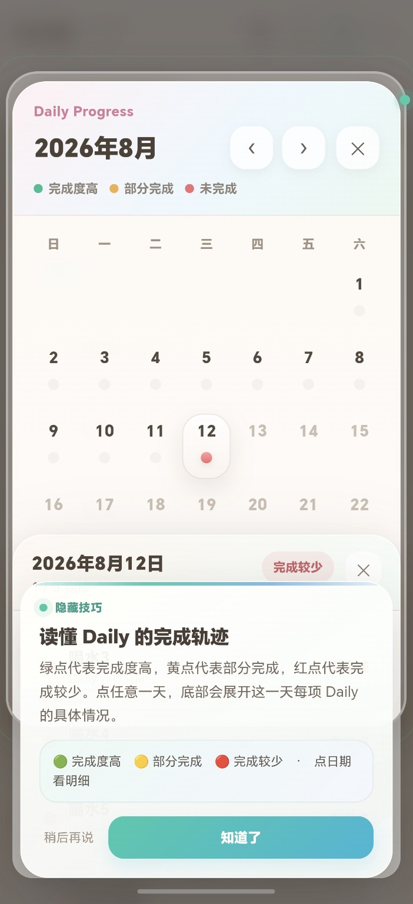
  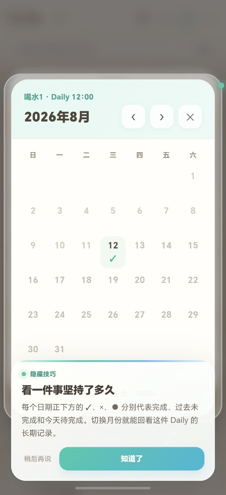
  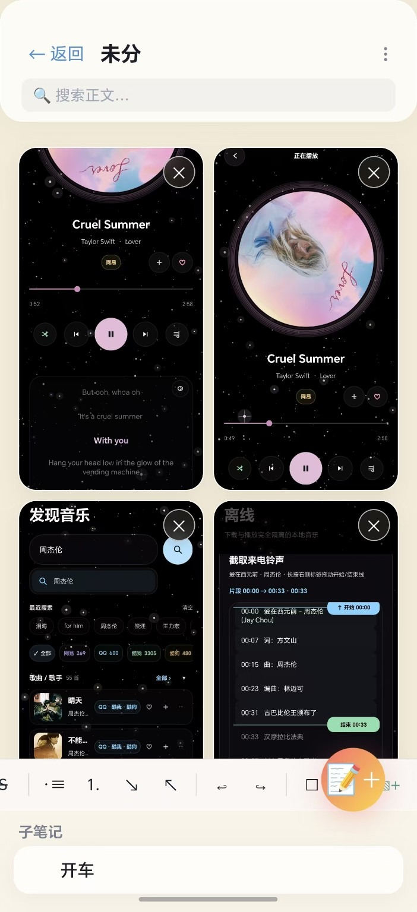
</p>

## Short demo

<p align="center">
  <a href="docs/media/reminder-gestures.mp4">
    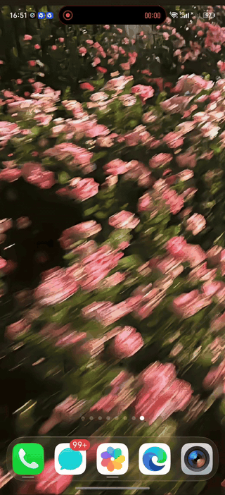
  </a>
</p>

Banner reminders support **swipe right to snooze**, **swipe left to dismiss**, **swipe up to complete**, and **swipe down to open the app**.

## Key features

- Three-state To-Do items: pending / in-progress / done
- Independent **Daily** items that reset every day
- **Note** mode with folders, sub-notes, rich text, and image insertion
- Android overlay reminder banners with gesture controls
- Visual onboarding + contextual hidden-feature coaching
- Optional AI assistant (no API key shipped in this repo)

## Build

Open the project root in Android Studio and build `app`, or run:

```bash
./gradlew assembleDebug
```

On Windows you can also use:

```text
build-apk.bat
```

Download the latest APK from [GitHub Releases](https://github.com/C666249/To-Do/releases/latest).

Direct download: [**To-Do-v1.19.1.apk**](https://github.com/C666249/To-Do/releases/latest/download/To-Do-v1.19.1.apk)

## Privacy

Core task, note, and Daily data is stored locally. See [`PRIVACY.md`](PRIVACY.md) and [`SECURITY.md`](SECURITY.md) for details.

## License

MIT.
